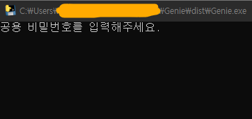
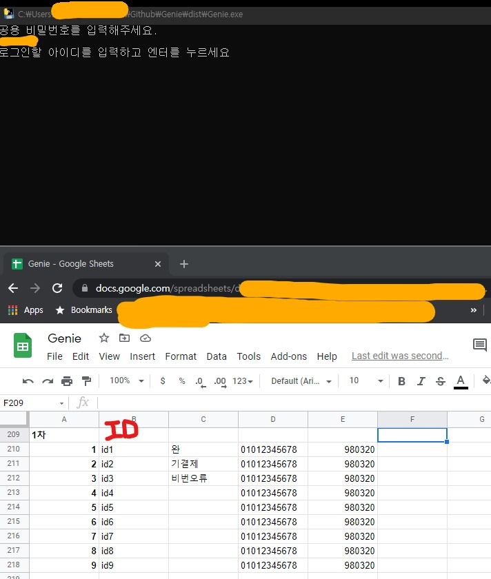
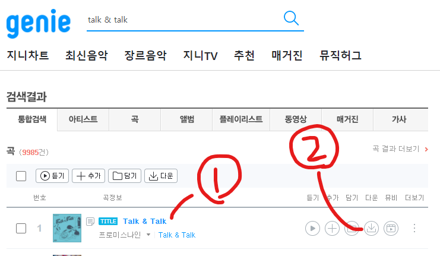
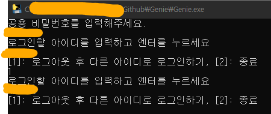

# 지니 자동 로그인, 로그아웃 프로그램

[다운로드 링크](https://drive.google.com/file/d/1JfsYml6p-vij7XRWCDFAvcxbAmIfCzOY/view?usp=sharing)

좋아요나 음원 다운로드는 직접 해야합니다 ㅠ
음원 다운로드 경로는 Genie.exe가 있는 경로로 자동 지정되며,
삭제는 자동으로 됩니다.

#### 1. Genie.exe 실행

알림창 뜨는데 네트워크 허용해줍니다.

#### 2. 공용 비밀번호 입력 & 아이디 입력

공지받은 비번을 복붙해줍니다.

Ctrl + C, V 쌉가능

로그인할 아이디도 복붙해줍니다.

#### 3. 로그인 후 좋아요, 결제 진행

이건 아직 자동으로 안됩니당..

3-1. 플레이어 창 실행해서 좋아요 창을 닫습니다.

3-2. 결제 창 실행해서 결제하고 창을 닫습니다.

#### 4. 직접 좋아요, 다운로드 진행

1 입력: 다른 아이디로 진행

2 입력: 종료

음원은 이 단계에서 자동으로 삭제합니다.

#### 5. 전반적인 창 배치

이렇게 하니 편했어요

급하게 만든거라 최소한의 에러 처리만 되어있으니 부정확한 계정 정보로 생기는 오류는 처리하지 않았습니다.

혼자만 쓰려다 공개한거라 양해부탁해영.
